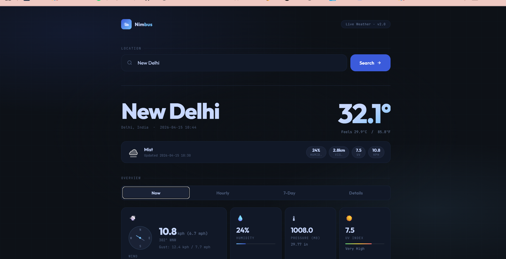

# 🌤️ Weather Forecast Web Application



---

## 📌 Description

This is a Flask-based weather web application that provides real-time weather information for any user-specified location. The application fetches live data from an external weather API and displays key details such as temperature, weather conditions, wind, humidity, and air quality index (AQI).

---

## 🚀 Features

- 🌍 Search weather by location
- 🌡️ Temperature in Celsius and Fahrenheit
- 🌫️ Air Quality Index (AQI) with category
- 🌬️ Wind speed, humidity, pressure, visibility
- ⚠️ Weather alerts support
- 🎨 Clean, minimal, responsive UI
- 🔄 Real-time API integration

---

## 🛠️ Technologies Used

- **Flask** – Backend framework
- **HTML, CSS, JavaScript** – Frontend
- **Jinja** – Templating engine
- **Requests** – API calls
- **WeatherAPI** – Weather data provider

---

## ⚙️ Installation

1. Clone the repository:

```bash
git clone https://github.com/hretzx/pythonProject.git
cd pythonProject
```

2. Install dependencies:

```bash
pip install -r requirements.txt
```

3. Create a `.env` file:

```env
API_KEY=your_weather_api_key_here
```

---

## ▶️ Run the App

```bash
python app.py
```

Open in browser:
http://127.0.0.1:5000/

---

## 📷 Screenshots


---

## 📖 Usage

1. Enter a location
2. Click **"Get Weather"**
3. View real-time weather details

---

## 🔮 Future Improvements

- Multi-day and hourly forecast
- Data visualization (graphs/charts)
- Auto-location detection
- Dynamic UI themes

---

## 👩‍💻 Authors

- **Sakshi Sawant** (24102C0072)
- **Hritvi Narvekar** (24102C0073)